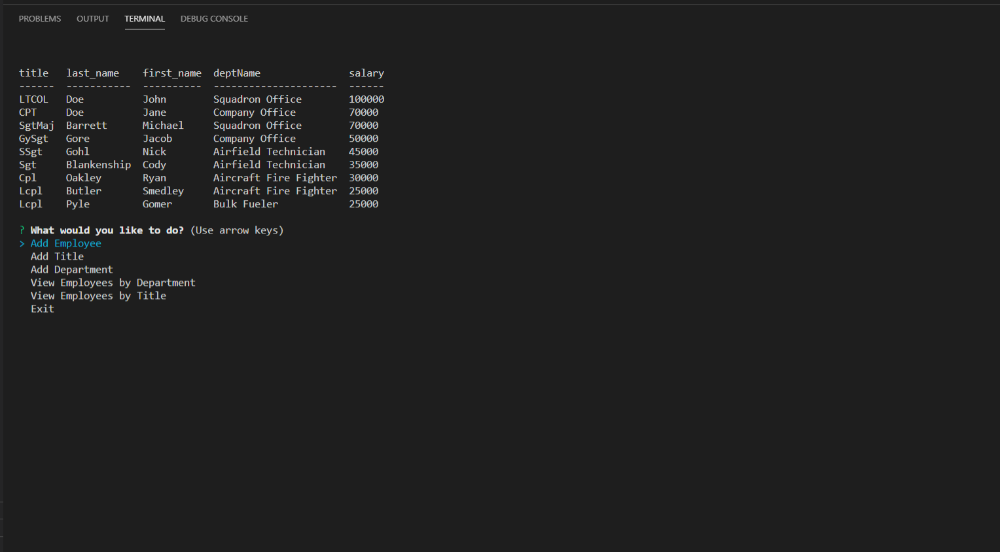

# Employee Tracker

## Description:
With this app you can view all of your employees, and can also view them by department or title. You can also add departments, titles, and employees to the list!

## Table of Contents:

* [Installation](#installation)
* [Information](#Information)
* [License](#license)
* [Contributing](#contributing)
* [Tests](#Tests)
* [Questions](#questions)

## Installation

To install all necessary dependencies, run the following command:

" npm i "

## Information

Run the app in the terminal by using "node server.js" then scroll through the choices

Link to video walkthrough: [Here](https://drive.google.com/file/d/1epUHhgr_Ku_lhKvgMdNkoWcBnS2-XxLl/view)

## License

This project is licensed under the MIT license.

## Contributing

To contribute to this repo, create a pull request!

## Tests

To run tests on the repo, run the following command:

" npm test "

## Questions

If you have any questions or comments about the repo, please feel free to email me at ydoc118@gmail.com,
or visit my GitHub to see more of my work at [Ydoc118](https://github.com/Ydoc118)

## Image of Repo

     